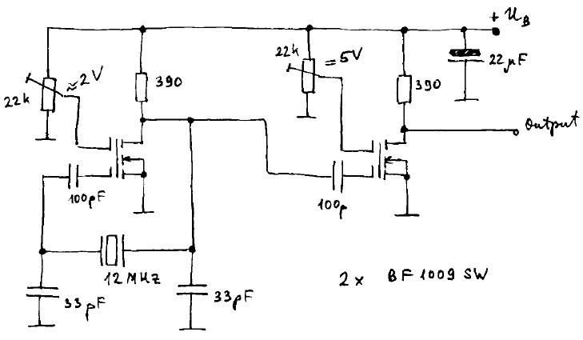
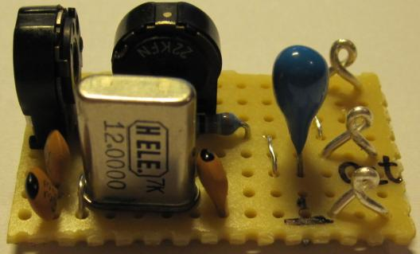
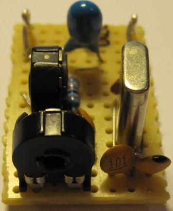
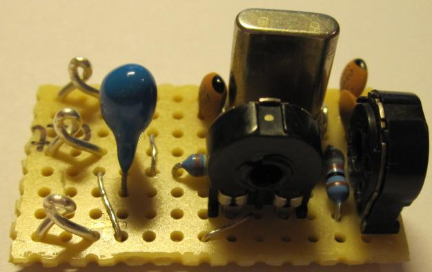
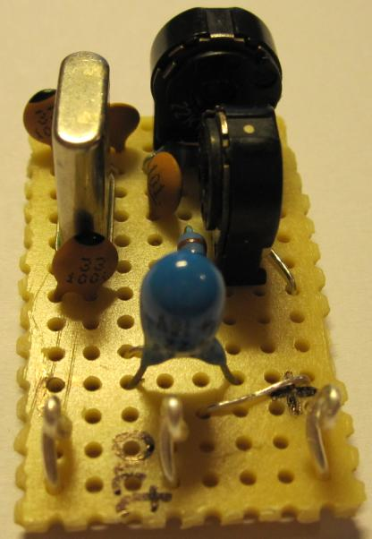
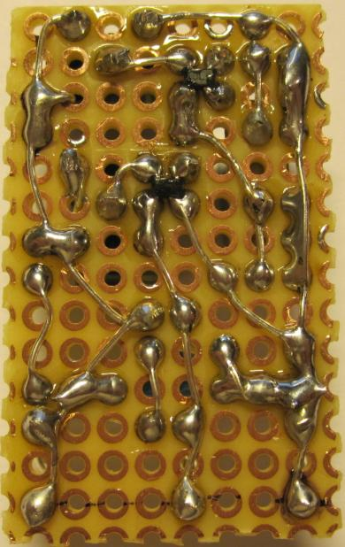

# 12 MHz crystal oscillator with BF1009SW

## Schematics

## Board view
### Top of the board 1

### Top of the board 2

### Top of the board 3

### Top of the board 4

### Bottom of the board

